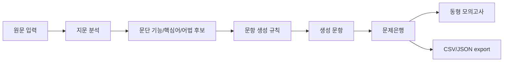

# KY Transform Engine 운영 설계

## 목적

`KY Transform Engine`은 광영여고 영어 기출 분석에서 뽑은 출제 방식을 반복 가능한 규칙으로 바꿔, 본문/학평 지문을 입력하면 변형문항 후보와 동형 모의고사 초안을 빠르게 만드는 로컬 도구다.

핵심 목표는 두 가지다.

1. 본문 변형문제를 대량 생산한다.
2. 실제 시험 구조에 가까운 동형 모의고사 제작 시간을 줄인다.

## 현재 구현

- 실행 화면: `site/engine.html`
- 핵심 엔진: `site/engine-core.js`
- 브라우저 UI: `site/engine-ui.js`
- 전용 스타일: `site/engine.css`

현재 엔진은 규칙 기반 MVP다. 외부 API 없이 브라우저에서 바로 작동하며, 원문을 붙여넣고 `분석 실행 -> 문항 생성 -> 문제은행 저장 -> 동형 모의 조립` 순서로 쓴다.

## 데이터 흐름

## 생성 유형

- 요지/제목
- 내용 불일치
- 문맥상 어휘
- 어법 객관식
- 어법수정 단답
- 순서
- 문장삽입
- 요약 단답
- 조건 영작

## 광영여고식 규칙

고1 프리셋은 `YBM박 본문 + 과거 고1 학평 변형`에 맞췄다.

- 교과서 본문: 목적, 요지, 내용 불일치, 어법, 문맥어휘, 요약 단답으로 재가공
- 학평 지문: 원래 유형을 그대로 쓰지 않고 빈칸, 삽입, 어법, 요약, 불일치로 전환
- 단답형: 핵심어 복원, 어법수정, 조건 영작 중심
- 오답: 부분일치, 극성 반전, 범위 확대/축소, collocation 오류를 우선 사용

고2 프리셋은 `학평 클러스터 + 작품/수업지문 단답형`에 맞췄다.

- 최신 또는 인접 학평 지문을 제목, 내용불일치, 어법으로 전환
- 작품/수업지문은 어법수정과 조건 영작 비중 확대
- 객관식보다 생산형 단답의 검수 기준을 강하게 적용

## 검수 기준

문항마다 다음 항목을 확인한다.

- 정답 단일성
- 원문 근거 앵커
- 오답 매력도 태그
- 변형 규칙 명시
- 단답형 채점 기준
- 난도와 배점 추정

엔진은 자동으로 `검수통과`, `수정필요`, `폐기권장` 상태를 붙인다. 이 상태는 최종본 확정이 아니라 1차 필터다.

## 운영 루틴

1. 시험범위 지문을 하나씩 붙여넣는다.
2. 문단 기능과 핵심어가 정상인지 확인한다.
3. 유형별 30~60문항을 생성한다.
4. 생성 문항 중 근거와 정답이 분명한 것만 문제은행에 저장한다.
5. 문제은행을 150~300문항까지 쌓는다.
6. 동형 모의고사를 3회 이상 조립한다.
7. 학생 오답 데이터를 기준으로 약한 유형만 다시 생성한다.

## 다음 고도화

- HWP/PDF 원문 자동 추출기 연결
- 학평 원문 출처 DB와 exact phrase 매칭
- LLM 기반 고급 문항 검수 어댑터
- 지문별 출제 가능성 점수화
- 교사용 정답/해설 PDF export
- 학생별 취약 유형 자동 숙제 생성
